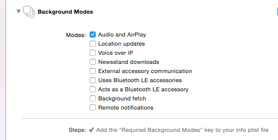

# BackgroundSound

First we have to go to the Capabilities tab of the project and select the  *Audio and Airplay* checkbox.




Then, before playing the sound we have to setup the mode:


```
  // Configure the audio system
    AudioSessionInitialize(NULL,NULL,NULL,NULL);
    
    OSStatus activationResult = 0;
    activationResult          = AudioSessionSetActive(true);
    
    UInt32 sessionCategory = kAudioSessionCategory_MediaPlayback;
    
    AudioSessionSetProperty
    (
     kAudioSessionProperty_AudioCategory,
     sizeof(sessionCategory),
     &sessionCategory
     );
    
    OSStatus propertySetError = 0;
    UInt32 allowMixing        = true;
    
    propertySetError = AudioSessionSetProperty
    (
     kAudioSessionProperty_OverrideCategoryMixWithOthers,
     sizeof(allowMixing),
     &allowMixing
     );
```


Format: 
